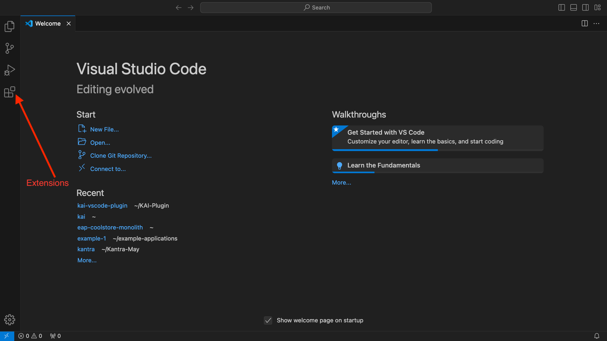
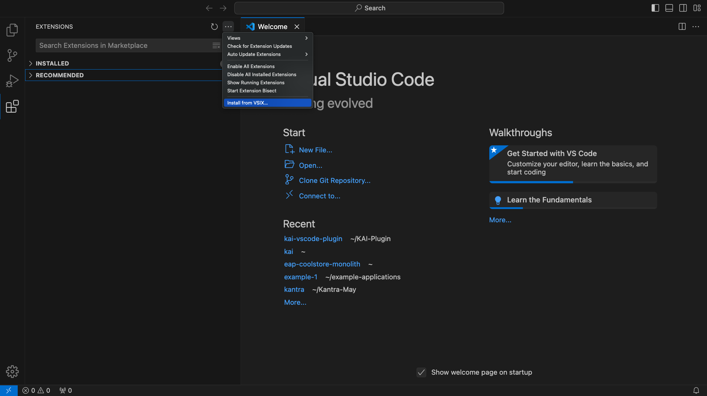
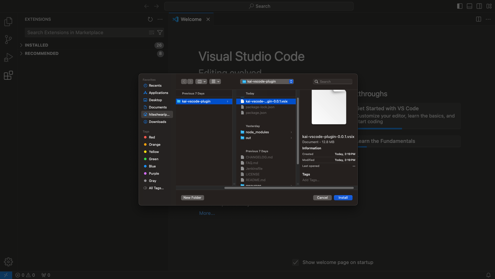
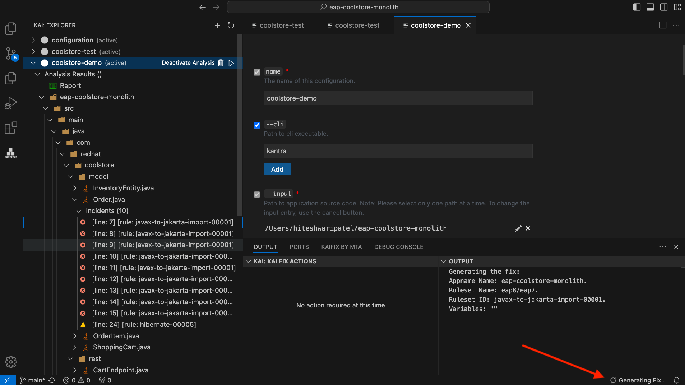

# Kai VSCode Extension
## IDE Builds
We provide built versions of the IDE plugin as a `vsix` file in the [kai-vscode-plugin/builds](/builds) directory.  We recommend you download the latest version available.

## Pre-requisite
1. Ensure you can run [Kantra](https://github.com/konveyor/kantra) locally
2. Install [Kai](https://github.com/konveyor-ecosystem/kai) backend

### Ensure you can run Kantra locally

* See [Kantra Installation Guide](https://github.com/konveyor/kantra?tab=readme-ov-file#installation) or if you can follow how we run from the [kai](https://github.com/konveyor-ecosystem/kai) project

* In [kai](https://github.com/konveyor-ecosystem/kai) we have a few scripts to help with installing Kantra and running an analysis.

  1. Ensure podman is running (for MacOS we need to run a podman VM): [samples/macos/restart_podman_machine.sh](https://github.com/konveyor-ecosystem/kai/blob/main/samples/macos/restart_podman_machine.sh)
  1. Fetch the Kantra binary, we will download it from a container image: [samples/macos/get_latest_kantra_cli.sh](https://github.com/konveyor-ecosystem/kai/blob/main/samples/macos/get_latest_kantra_cli.sh)

- You can run the below scripts to run an analysis from the `kai/example` directory:

  1. `git clone https://github.com/konveyor-ecosystem/kai.git`
  1. `cd kai/example`
  1. Fetch source code to run analysis against via: [./fetch.sh](https://github.com/konveyor-ecosystem/kai/blob/main/example/fetch.sh)
     - Will clone a git repo of the sample [coolstore](https://github.com/konveyor-ecosystem/coolstore) app
  1. Will run Kantra to analyze the previously cloned source repo: [./analyze](https://github.com/konveyor-ecosystem/kai/blob/main/example/analyze.sh)

- It is important that Kantra is able to run successfully on your machine before you proceed with the IDE extension. It will need to do a similar step of running Kantra from inside of the IDE.

### Setup Kai (backend)

* See [KAI Installation Guide](https://github.com/konveyor-ecosystem/kai?tab=readme-ov-file#demo-pre-requisites)


## IDE Plugin Installation Methods

You have a choice of installing the `vsix` file from the VSCode GUI or direct from the command line.

### Using VSCode GUI (recommended install option)

1. Open Visual Studio Code.
2. Navigate to the Extensions view by clicking on the square icon on the sidebar or by pressing `Ctrl+Shift+X` (Windows/Linux) or `Cmd+Shift+X` (macOS).

3. Click on the `...` (More Actions) button at the top right corner of the Extensions view and select **Install from VSIX...** from the dropdown menu.

4. Locate and select the .vsix file you downloaded and click **Install**.

5. Reload VSCode to activate the extension.


### Using Command Line (alternative installation method)

Only follow these steps if you decided to skip installing from the UI side and you want to install from CLI.

1. Install `vsce` by running `npm install -g vsce` in your terminal.
2. Install the .vsix file with the following command:
   ```bash
   code --install-extension path/to/your-extension.vsix 
    ```
3. Restart/reload VSCode.

# Using the IDE Plugin

### Get a Demo App

1. Clone the Cool-store application:
   ```bash
   git clone https://github.com/konveyor-ecosystem/coolstore.git
    ```
1. Ensure you have the  [Kai](https://github.com/konveyor-ecosystem/kai) project setup and cloned, you will need access to the [custom_rules](https://github.com/konveyor-ecosystem/kai/tree/main/samples/custom_rules) for the demo app
2. Navigate to File > Open in VSCode and locate the folder we just cloned.

### Running Kantra Analysis

1. Navigate to the KAI plugin in VSCode.

2. Set the configuration parameters as shown below:
- Input: path to coolstore app
- CLI: `kantra`
- Target: `containerization`, `jakarta-ee`, `jakarta-ee8+`, `jakarta-ee9+`, `quarkus` (if your target is unavailable, click "Add", type your target, and hit enter)
- Rules: Navigate to the path [custom_rules](https://github.com/konveyor-ecosystem/kai/tree/main/samples/custom_rules)
3. Click the `Run` button to start the analysis.
4. Wait for the analysis to complete successfully (expect about 2-3 minutes).


### Running Kai-Fix

1. Ensure your KAI backend is running.
2. To fix all incidents or the file, right-click on the file and select `Kai-Fix All`.

3. To fix a single incident, right-click on the incident and select `Generate Kai-Fix`.

4. After the fix is generated, proposed changes will appear on the right side of the diff editor, while the original file displays on the left.

5. If you find the proposed changes unconvincing, you have the option to revert them by clicking (→).

6. Clicking "Accept Changes" will save the proposed changes and replace the original file. Selecting "Reject Changes" will discard the proposed changes and close the editor.
